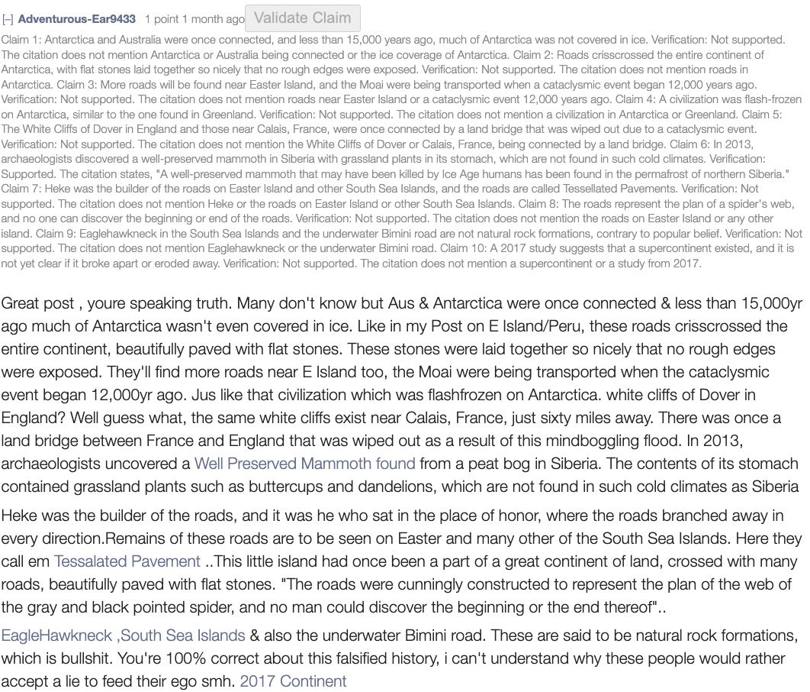

# ClaimValidator
Increase trust on internet by checking whether the claims people make are really substantiated by their sources or not. 

[Chrome Extension Homepage](https://chromewebstore.google.com/detail/claimvalidator/clkakakhimoekhkimloikphebkmoinfe)

## Motivation
Have you ever encountered someone posting outlandish claims, all while trying to back it up with sources that don't prove their point? And let's not forget clickbait titles as well.

In the age of Generative AI, where comments and posts are increasingly manufactured, we'll probably be seeing more and more of that. In the absence of any checks on this system, trust on the internet will gradually erode until there is no objective truth left.

This is a companion tool that aims to counter that trend, ironically using Generative AI itself to do it.

Currently, it works on Old Reddit comments, including a "Validate Claim" button on every comment with a link. When you click on the button, an analysis is kicked off to (1) extract all the claims the user is making, (2) pull all the information from their source, and (3) check whether each claim is substantiated by the source. Steps 1 and 3 are done by instruction fine-tuned LLMs.

## Screenshots

## Future Work
This is an open-source project in active development. Future updates will include:
1. Support Reddit posts in addition to comments; this will counteract clickbait, sensationalist, and misleading titles
2. Support multiple sources in the same comment
3. Looking at nearby comments to better understand the claims a user is trying to make
4. Support for more websites, including Twitter and Wikipedia
5. Additional tools beyond just claim verification

## Chrome Extension Homepage
https://chromewebstore.google.com/detail/claimvalidator/clkakakhimoekhkimloikphebkmoinfe

The reviewal process takes a few business days because this extension requires permissions for all urls in order to extract the text from citations.

## Requirements to Build
1. npm: https://www.npmjs.com/
2. OpenRouter Account: https://openrouter.ai/
3. Modal Account: https://modal.com/

## Steps to Build
1. Clone the repository
2. Run `npm install` to install all the dependencies
3. Optionally edit any files in the `src` and `modal-llm-server` folders
4. Within `modal-llm-server`, run `modal deploy server.py` to deploy the Modal app
5. In Modal, create a new set of secrets called "claim-validator-secrets" and set CHROME_DEV_EXTENSION_ID, CHROME_PROD_EXTENSION_ID, and LLM_API_KEY. The latter is your OpenRouter API key. Adjust these values as needed when you later deploy the chrome extension.
6. Rename `.env.example` to `.env` and fill in the URL for your modal app for LLM_CLAIM_VALIDATION_SERVER_URL
7. Run `npm run build` to use webpack to pack files with Webpack

## Steps to Test
1. Open Chrome and go to `chrome://extensions/`
2. Enable Developer Mode
3. Click on Load Unpacked
4. Select the `dist` folder in the repository
5. The extension should now be installed, and you should see a "Validate Claim" button on every Old Reddit comment with a link 
6. Click on the "Validate Claim" button to see the extension in action
